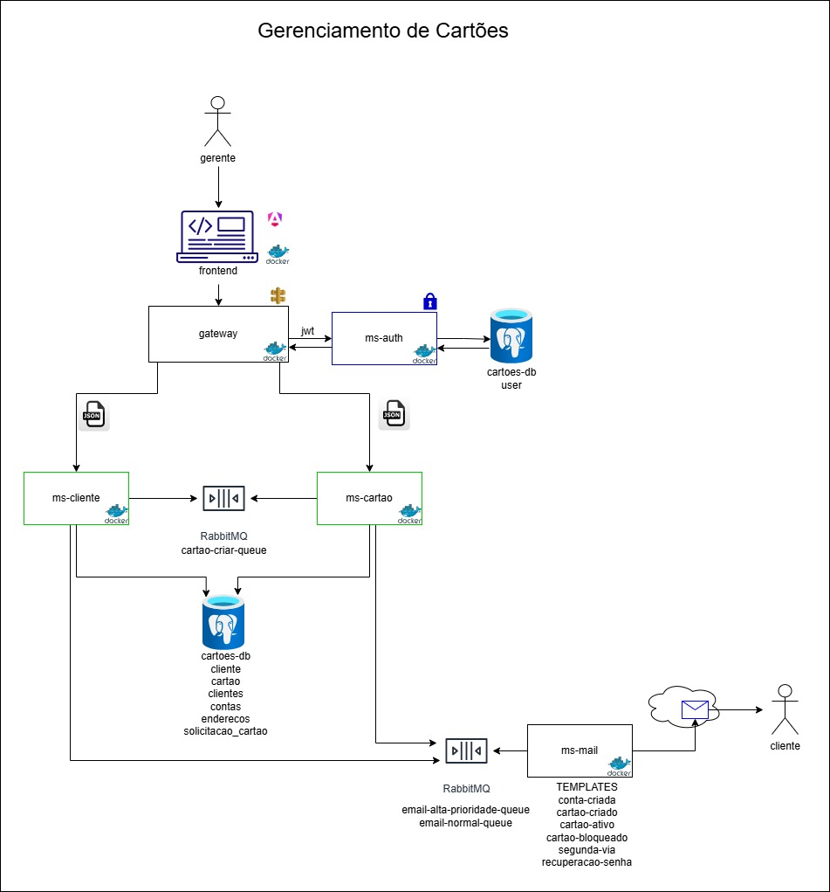

# 💳 Gerenciador de Cartões

Projeto desenvolvido como parte do **TCC do curso de Upskilling em Desenvolvimento Full Stack Java** da **Proway**.  
O sistema tem como objetivo demonstrar a aplicação de uma arquitetura moderna baseada em **microsserviços**, **API Gateway**, **autenticação JWT** e **frontend Angular 20**, integrando todos os módulos através de containers **Docker**.

---

## 🧭 Visão Geral

O **Gerenciador de Cartões** é uma plataforma completa para gerenciamento de clientes, cartões e autenticação de usuários.  
O sistema foi construído seguindo os princípios de **arquitetura distribuída** e **modularidade**, permitindo escalar e manter cada serviço de forma independente.

---

## 🎯 Objetivos do Projeto

- Aplicar os conceitos de **microsserviços** em um sistema corporativo.  
- Implementar **autenticação JWT** e segurança entre os módulos.  
- Demonstrar o uso de **Spring Cloud Gateway** como ponto central de roteamento.  
- Integrar **Spring Boot**, **Angular 20** e **Docker Compose**.  
- Simular um ambiente real de produção com serviços independentes e comunicantes.  
- Servir como projeto final do curso **Upskilling Proway**.

---

## 🧩 Estrutura e Arquitetura

gerenciador-cartoes/

│
├── gateway/ # API Gateway com autenticação JWT
├── ms-auth/ # Microsserviço de autenticação e controle de usuários
├── ms-cliente/ # Microsserviço de gerenciamento de clientes
├── ms-cartao/ # Microsserviço de gestão de cartões e limites
├── ms-email/ # Microsserviço de envio de e-mails (notificações)
├── frontend/ # Aplicação Angular 20 (interface do usuário)
├── docker-compose.yml # Orquestração via Docker
└── README.md # Documento de apresentação (este arquivo)


---

## 🧱 Arquitetura

O sistema segue o padrão **API Gateway + Microsserviços**, com comunicação via HTTP REST e mensageria via **RabbitMQ**.




Cada serviço é independente e possui seu próprio `pom.xml`, podendo ser executado individualmente ou em conjunto via Docker.

---

## ⚙️ Tecnologias Utilizadas

### 🖥️ Back-end
- **Java 17**
- **Spring Boot 3+**
- **Spring Cloud Gateway**
- **Spring Security / JWT**
- **Spring Data JPA**
- **Spring AMQP (RabbitMQ)**
- **Jakarta Validation**
- **Lombok**
- **Maven**

### 💻 Front-end
- **Angular 20**
- **TypeScript**
- **Bootstrap / Tailwind (opcional)**
- Consumo de APIs REST com autenticação JWT

### 🐳 Infraestrutura
- **Docker / Docker Compose**
- **RabbitMQ**
- **PostgreSQL**
- **Spring Mail (SMTP)**

---

## 🚀 Execução do Projeto

### 🔸 Executar com Docker

Na raiz do projeto (`gerenciador-cartoes/`):

```bash
docker-compose up --build


O Docker irá:

Construir e iniciar todos os microsserviços e o frontend.

Subir o RabbitMQ, banco de dados e gateway.

Acesse:

Frontend: http://localhost:4200

API Gateway: http://localhost:8080

RabbitMQ UI: http://localhost:15672

🔐 Autenticação e Segurança

Fluxo baseado em JWT (JSON Web Token):

O usuário realiza login em /auth/login (ms-auth).

Recebe um token JWT.

O Gateway valida o token em cada requisição e redireciona para o serviço correto.

🧩 Descrição dos Microsserviços

🔹 ms-auth – Autenticação e Usuários

Responsável pelo registro e autenticação dos usuários, geração e validação de tokens JWT.

Endpoints:
| Método | Endpoint         | Descrição                   |
| ------ | ---------------- | --------------------------- |
| `POST` | `/auth/register` | Cadastra novo usuário       |
| `POST` | `/auth/login`    | Realiza login e retorna JWT |
| `GET`  | `/auth/validate` | Valida token JWT            |


🔹 ms-cliente – Gerenciamento de Clientes

Gerencia dados cadastrais e informações pessoais dos clientes.

Endpoints:
| Método   | Endpoint         | Descrição               |
| -------- | ---------------- | ----------------------- |
| `POST`   | `/clientes`      | Cria um novo cliente    |
| `GET`    | `/clientes`      | Lista todos os clientes |
| `GET`    | `/clientes/{id}` | Retorna cliente por ID  |
| `PUT`    | `/clientes/{id}` | Atualiza cliente        |
| `DELETE` | `/clientes/{id}` | Remove cliente          |


🔹 ms-cartao – Gerenciamento de Cartões

Administra cartões vinculados a clientes, limites e status.

Endpoints:
| Método   | Endpoint                       | Descrição                   |
| -------- | ------------------------------ | --------------------------- |
| `POST`   | `/cartoes`                     | Cadastra um novo cartão     |
| `GET`    | `/cartoes`                     | Lista todos os cartões      |
| `GET`    | `/cartoes/{id}`                | Detalha um cartão           |
| `PUT`    | `/cartoes/{id}`                | Atualiza dados              |
| `DELETE` | `/cartoes/{id}`                | Remove cartão               |
| `GET`    | `/cartoes/cliente/{idCliente}` | Lista cartões de um cliente |


🔹 ms-email – Microsserviço de Envio de E-mails

Responsável por receber mensagens via RabbitMQ, processar templates com Thymeleaf e enviar e-mails transacionais.

🔸 Estrutura de Mensagem (DTO)
public class EmailMessageDTO {
    private String tipo;      // Tipo do e-mail / nome do template
    private String email;     // Endereço do destinatário
    private String nome;      // Nome do destinatário
    private Map<String, Object> dados; // Variáveis do template
}
🔸 Filas e Routing Keys
Fila	Routing Key	Descrição
email-normal-queue	email.normal	E-mails padrão
email-alta-prioridade-queue	email.alta	E-mails de alta prioridade
email-dlq	—	Mensagens não processadas (Dead Letter Queue)
🔸 Exemplos de Payloads

Cartão Ativo
{
  "tipo": "cartao-ativo",
  "email": "cliente@example.com",
  "nome": "Josiane",
  "dados": { "finalCartao": "1234" }
}

Recuperação de Senha
{
  "tipo": "recuperacao-senha",
  "email": "cliente@example.com",
  "nome": "Josiane",
  "dados": {
    "linkRecuperacao": "https://meusistema.com/redefinir-senha?token=abc123"
  }
}

Cartão Criado
{
  "tipo": "cartao-criado",
  "email": "cliente@example.com",
  "nome": "Josiane",
  "dados": {
    "numeroCartao": "**** **** **** 3456",
    "dataEmissao": "27/10/2025"
  }
}

Cartão Bloqueado (Alta prioridade)
{
  "tipo": "cartao-bloqueado",
  "email": "cliente@example.com",
  "nome": "Josiane",
  "dados": {
    "finalCartao": "1234",
    "dataBloqueio": "2025-10-27",
    "suporteLink": "https://meusistema.com/contato"
  }
}

Segunda Via do Cartão
{
  "tipo": "segunda-via",
  "email": "cliente@example.com",
  "nome": "Josiane",
  "dados": {
    "finalCartao": "1234",
    "statusEnvio": "Em transporte",
    "previsaoEntrega": "31/10/2025"
  }
}

Conta Criada
{
  "tipo": "conta-criada",
  "email": "cliente@example.com",
  "nome": "Josiane",
  "dados": {
    "dataCriacao": "2025-10-27"
  }
}

🔸 Fluxo de Comunicação

ms-cliente e ms-cartao enviam mensagens para o RabbitMQ.

O ms-email consome as mensagens das filas (email.normal ou email.alta).

Processa o template HTML correspondente com Thymeleaf.

Envia o e-mail via SMTP.

Mensagens não entregues são movidas para email-dlq.

🧪 Testes e Validação

Testes unitários e de integração com JUnit 5 e Spring Boot Test.

Validação dos endpoints via Swagger UI ou Postman.

Teste de envio de mensagens RabbitMQ → ms-email.

📈 Aprendizados e Conclusão

Durante o desenvolvimento deste projeto foram aplicados conceitos de:

Arquitetura de microsserviços

Comunicação via API Gateway e mensageria RabbitMQ

Segurança e autenticação JWT

Containerização com Docker

Desenvolvimento de frontend moderno com Angular 20

Integração contínua e boas práticas com Spring Boot

O Gerenciador de Cartões representa o resultado prático dos conhecimentos adquiridos no curso Upskilling Full Stack Java – Proway, demonstrando domínio em desenvolvimento backend, frontend e integração entre serviços.

👩‍💻 Autoria

Desenvolvido por: Josiane, Nicolle, José Vitor, Tomás e Kamila
Curso: Upskilling em Desenvolvimento Full Stack Java – Proway
Ano: 2025
Contato: www.linkedin.com/in/josiane-begnini


